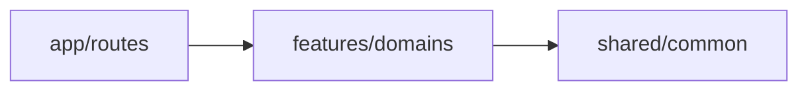

# ASCII Diagram Creator

Generate clear, terminal-compatible ASCII diagrams for system architecture, migrations, and data flows.

## Quick Start

Simply describe what you want to visualize:

```
"Create a diagram showing how our authentication module connects to the database"
"Show before and after for our directory restructuring"
"Diagram the three phases of our migration plan"
"Illustrate how data flows from the API to the frontend"
```

## Features

### Five Diagram Types

1. **Architecture** - System components and their relationships
2. **Before/After** - Compare current vs proposed state
3. **Phased Migration** - Step-by-step progression with status
4. **Data Flow** - How data moves through the system
5. **Relationship/Synergy** - How elements interact or complement each other

### Auto-Discovery Mode (v0.2.0)

Automatically scans your codebase to populate diagrams:
- Detects project type (Bulletproof React, Next.js, Express, Monorepo)
- Discovers feature boundaries, routes, and API layers
- Reduces 50% of manual codebase exploration

### Project-Type Templates (v0.2.0)

Pre-built templates for common architectures:
- **Bulletproof React** - Feature-based architecture with import rules
- **Next.js App Router** - Route groups and server components
- **Express API** - Layered architecture (routes → controllers → services)
- **Monorepo** - Apps and packages dependency flow

### Diagram Versioning (v0.2.0)

Track diagram freshness with metadata:
```markdown
<!-- diagram-meta
  created: 2025-01-23
  last-verified: 2025-01-23
  source-patterns: [src/features/*, src/app/routes/*]
  stale-after: 30d
-->
```

### Mermaid Export (v0.3.0)

Convert ASCII diagrams to Mermaid syntax for graphical rendering:
- Works in GitHub, GitLab, Notion, and other platforms
- Preserves structure, arrows, and groupings
- Includes status styling with CSS classes



### Git-Aware Staleness Detection (v0.3.0)

Automatically detect outdated diagrams based on git history:
- Checks if source files have changed since last verification
- Generates staleness report with recommended actions
- Flags diagrams as STALE, CURRENT, or OUTDATED

### PR Template Integration (v0.3.0)

Seamlessly integrate diagrams into your PR workflow:
- Auto-suggest inclusion in PR descriptions
- Option to update PR templates with diagram section
- Include architecture impact documentation

### CLAUDE.md Directive Setup (v0.3.0)

Configure proactive diagram suggestions:
- Add semantic triggers to your CLAUDE.md
- Auto-suggest diagrams for feature branches
- Customize trigger phrases for your workflow

### Professional Visual Elements

- Box-drawing characters for clean boundaries
- Directional arrows for relationships
- Status indicators for progress tracking
- 80-character max width for terminal compatibility

## Example Output

```
┌─────────────────────────────────────────────────────────┐
│                SYSTEM CONSOLIDATION PLAN                 │
└─────────────────────────────────────────────────────────┘

PHASE 1: Analysis
┌──────────────────┐
│ Current State    │──► Identify duplicates
│ 11 directories   │──► Find dependencies
│ 3 systems        │──► Check references
└──────────────────┘
         │
         ▼
PHASE 2: Migration
┌──────────────────┐
│ Moving Data      │
│ ✓ Memory files   │
│ ✓ Pattern files  │
│ ⏳ Script updates │
└──────────────────┘
         │
         ▼
PHASE 3: Validation
┌──────────────────┐
│ Final State      │
│ 2 directories    │──► All tests passing
│ 1 unified system │──► No duplicates
└──────────────────┘
```

## Use Cases

- **PR Descriptions**: Include before/after diagrams to clarify changes
- **Architecture Documentation**: Visualize system structure
- **Migration Planning**: Track progress through phases
- **Team Communication**: Share clear visual representations

## Tips

- **Be specific**: "Show the auth flow from login to token storage"
- **Mention status**: "Include progress indicators for each phase"
- **Request refinements**: "Make the boxes wider" or "Add a legend"

## Limitations

- Not for graphical/image output (use Mermaid for that)
- Max 80 characters wide for terminal compatibility
- Text-based only - no colors or special fonts

## Workflow Automation

Make diagram creation automatic by integrating with your development workflow.

### Option A: Hook-Based Auto-Trigger (Recommended)

Create a git hook that suggests diagrams when creating feature branches:

```bash
# .git/hooks/post-checkout
#!/bin/bash

# Trigger when creating feature branches
BRANCH_NAME=$(git rev-parse --abbrev-ref HEAD)
if [[ "$BRANCH_NAME" =~ ^feature/ ]]; then
  echo ""
  echo "📊 Architecture Diagrams Recommended"
  echo "Consider creating diagrams for this feature:"
  echo "  • Run: /ascii-diagram or invoke the skill"
  echo "  • Ask: 'create architecture diagram for this feature'"
  echo ""
fi
```

### Option B: CLAUDE.md Directive

Add to your project's CLAUDE.md to enable proactive suggestions:

```markdown
## Architecture Documentation Standards

### When Starting New Features
Before implementation, create or update ASCII diagrams in `docs/architecture/`:
- Use `ascii-diagram-creator` skill for feature boundaries
- Update architecture diagrams if adding new routes or features
- Include diagram in PR description for reviewer context

### Auto-Trigger Phrases
When user mentions: "new feature", "planning", "architecture", "how should I structure"
→ Proactively offer to create architecture diagrams
```

### Option C: Sub-Agent Integration

Create a feature-planner sub-agent that chains diagram creation:

```markdown
# .claude/agents/feature-planner.md
---
name: feature-planner
description: Plan new features with architecture visualization
tools: [Read, Write, Glob, Grep]
---

When planning a new feature:
1. Analyze existing architecture using auto-discovery
2. **Invoke ascii-diagram-creator** for visual planning
3. Generate feature scaffold based on diagram
4. Create initial test files
```

### Recommended Workflow

```
┌─────────────────────────────────────────────────────────────────┐
│              AUTOMATIC DIAGRAM GENERATION WORKFLOW              │
├─────────────────────────────────────────────────────────────────┤
│                                                                 │
│   1. Developer creates feature branch                           │
│      └──► Hook detects "feature/" prefix                        │
│                                                                 │
│   2. Hook injects context into conversation                     │
│      └──► "Architecture diagrams recommended for this feature"  │
│                                                                 │
│   3. Claude proactively offers diagram creation                 │
│      └──► Based on CLAUDE.md directive                          │
│                                                                 │
│   4. Diagrams created in docs/architecture/features/{name}.md   │
│      └──► Linked in PR template automatically                   │
│                                                                 │
└─────────────────────────────────────────────────────────────────┘
```

## Version History

- **v0.3.0** - Mermaid export, git-aware staleness, PR integration, CLAUDE.md directives
- **v0.2.0** - Auto-discovery, project templates, diagram versioning
- **v0.1.0** - Initial release with 5 diagram types
