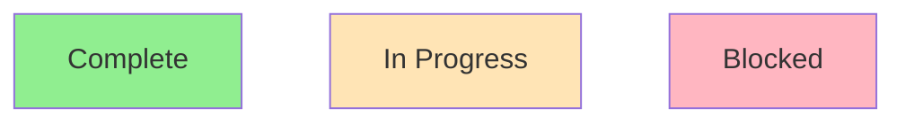
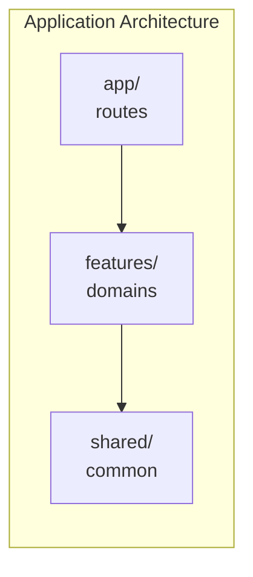
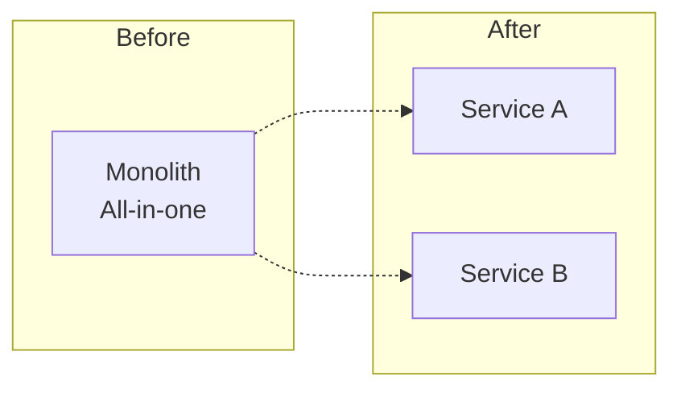
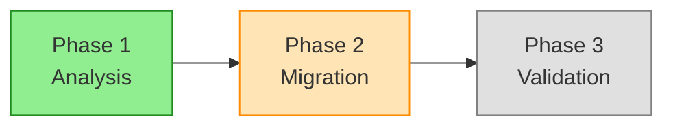
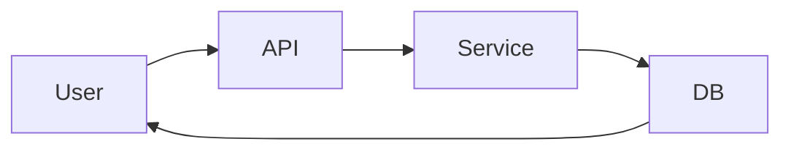
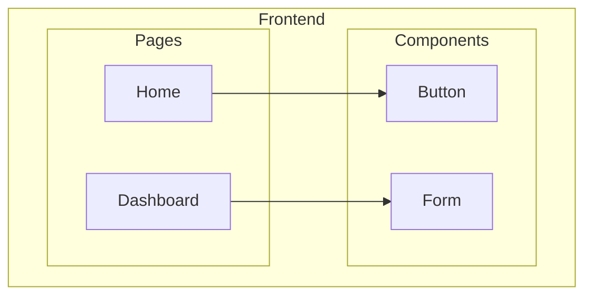
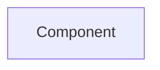
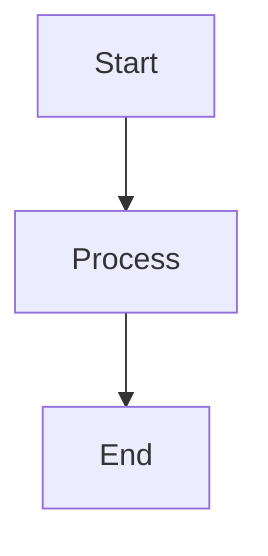

# Mermaid Export Guide

Convert ASCII diagrams to Mermaid syntax for graphical rendering in GitHub, GitLab, Notion, and other platforms that support Mermaid.

## When to Use Mermaid Export

- Documentation that will be viewed in GitHub/GitLab (renders automatically)
- Presentations where graphical output is preferred
- Teams that prefer visual diagrams over text-based
- When you need to iterate on diagrams in a visual editor

## Conversion Rules

### Basic Elements

| ASCII Element | Mermaid Syntax | Example |
|---------------|----------------|---------|
| `┌─────┐` Box | `[Label]` | `A[Component]` |
| `(( ))` Circle | `((Label))` | `A((Start))` |
| `{ }` Diamond | `{Label}` | `A{Decision}` |
| `──►` Arrow | `-->` | `A --> B` |
| `◄──` Reverse | `<--` | `A <-- B` |
| `◄─►` Bidirectional | `<-->` | `A <--> B` |
| `──✗` Blocked | `-.-x` | `A -.-x B` |
| Text on arrow | `-- text -->` | `A -- calls --> B` |

### Container Elements

| ASCII Pattern | Mermaid Equivalent |
|--------------|-------------------|
| Nested boxes | `subgraph` |
| Grouped components | `subgraph "Name"` |
| Layers | Multiple subgraphs |

### Status Indicators

Use Mermaid classes for status styling:



---

## Conversion Examples

### Architecture Diagram

**ASCII Input**:
```
┌─────────────────────────────────────────────────────────────┐
│                    APPLICATION ARCHITECTURE                  │
├─────────────────────────────────────────────────────────────┤
│  ┌─────────────┐     ┌─────────────┐     ┌─────────────┐   │
│  │   app/      │     │  features/  │     │   shared/   │   │
│  │  (routes)   │────►│  (domains)  │────►│  (common)   │   │
│  └─────────────┘     └─────────────┘     └─────────────┘   │
└─────────────────────────────────────────────────────────────┘
```

**Mermaid Output**:


### Before/After Diagram

**ASCII Input**:
```
BEFORE                          AFTER
┌──────────────┐               ┌──────────────┐
│  Monolith    │               │   Service A  │
│  All-in-one  │      ──►      ├──────────────┤
│              │               │   Service B  │
└──────────────┘               └──────────────┘
```

**Mermaid Output**:


### Phased Migration Diagram

**ASCII Input**:
```
PHASE 1: Analysis        PHASE 2: Migration       PHASE 3: Validation
┌──────────────┐        ┌──────────────┐         ┌──────────────┐
│ ✓ Complete   │───────►│ ⏳ In Progress│────────►│ ○ Pending    │
└──────────────┘        └──────────────┘         └──────────────┘
```

**Mermaid Output**:


### Data Flow Diagram

**ASCII Input**:
```
┌─────────┐     ┌─────────┐     ┌─────────┐     ┌─────────┐
│  User   │────►│   API   │────►│ Service │────►│   DB    │
└─────────┘     └─────────┘     └─────────┘     └─────────┘
      ▲                                              │
      └──────────────────────────────────────────────┘
```

**Mermaid Output**:


---

## Direction Options

Choose the flow direction based on diagram type:

| Direction | Syntax | Best For |
|-----------|--------|----------|
| Left to Right | `graph LR` | Data flows, pipelines |
| Top to Bottom | `graph TD` | Hierarchies, architecture |
| Bottom to Top | `graph BT` | Bottom-up structures |
| Right to Left | `graph RL` | Reverse flows |

---

## Advanced Features

### Subgraph Nesting



### Click Events (for interactive diagrams)



### Notes and Comments



---

## Platform Support

| Platform | Support | Notes |
|----------|---------|-------|
| GitHub | ✓ Native | Renders in markdown files and issues |
| GitLab | ✓ Native | Renders in markdown |
| Notion | ✓ Native | Use `/mermaid` block |
| VS Code | ✓ Extension | Mermaid Preview extension |
| Obsidian | ✓ Native | Built-in support |
| Confluence | ⚠️ Plugin | Requires Mermaid plugin |

---

## Conversion Tips

1. **Keep it simple**: ASCII diagrams with many nested elements may not convert cleanly
2. **Use subgraphs sparingly**: More than 2-3 levels of nesting gets hard to read
3. **Add line breaks**: Use `<br/>` in node labels for multi-line text
4. **Test rendering**: Preview in GitHub/GitLab before committing
5. **Preserve ASCII version**: Keep both formats for different use cases

---

## Quick Conversion Checklist

- [ ] Identify all boxes → Convert to nodes `[Label]`
- [ ] Identify all arrows → Convert to connections `-->`
- [ ] Identify groupings → Convert to `subgraph`
- [ ] Identify status indicators → Add `classDef` styles
- [ ] Choose direction (`LR` vs `TD`)
- [ ] Test rendering in target platform
